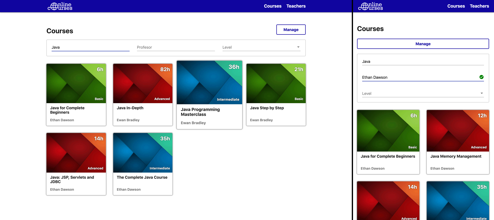
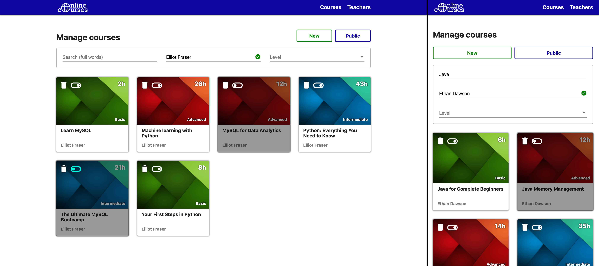
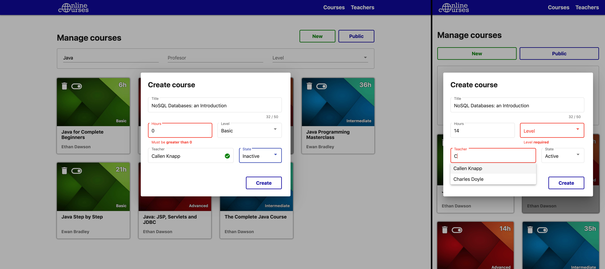
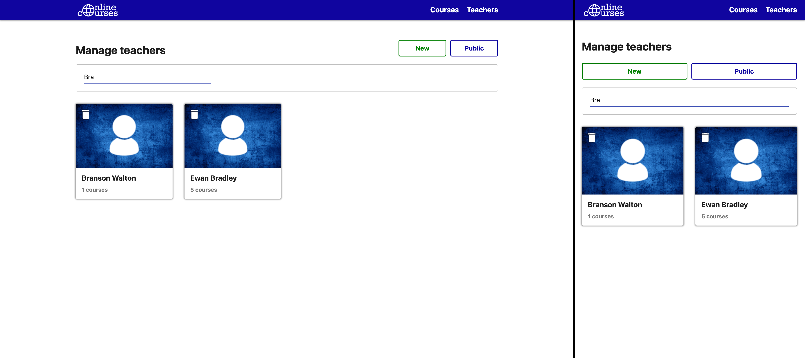
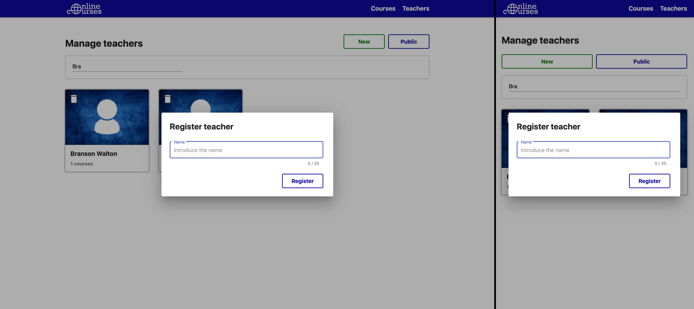

# Online Courses

A complete web app project made to practice both frontend and backend. Because I wanted to try out different technologies, I made two different and interchangeable backends. This service would supposedly be used by institutions who want to showcase their courses online, being able to add teachers and courses to the service.

## Technologies used

For this project I used the following technologies:

- **Angular 8** for the frontend. [More information](frontend#readme).
- **Java** with **Spring Boot** for the first alternative for the backend. [More information](backend-java#readme).
- **Node JS** with **TypeScript** and **Express** for the second alternative for the backend. [More information](backend-node#readme).
- **Docker** and **MySQL** for the database. [More information](database#readme).

## Installation

To get your own local version of the project up and running you will need:

- The **frontend**: follow [these steps](frontend#installation).
- One version of the **backend**:
  - **Java** version: follow [these steps](backend-java#installation).
  - **Node** version: follow [these steps](backend-node#installation).
- The **database**: follow [these steps](database#installation).

Note: make sure to start the database docker before the backend.

## Screenshots

